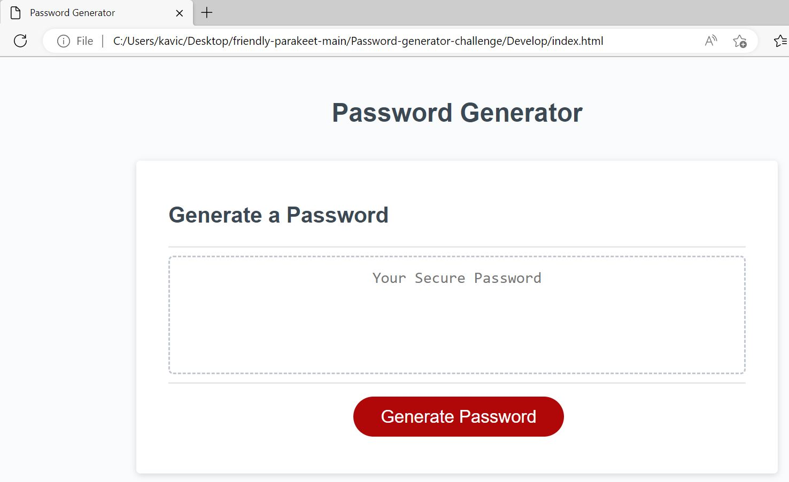
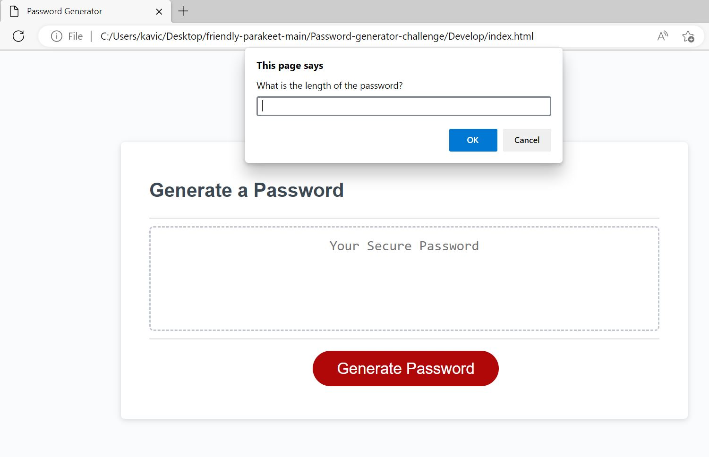
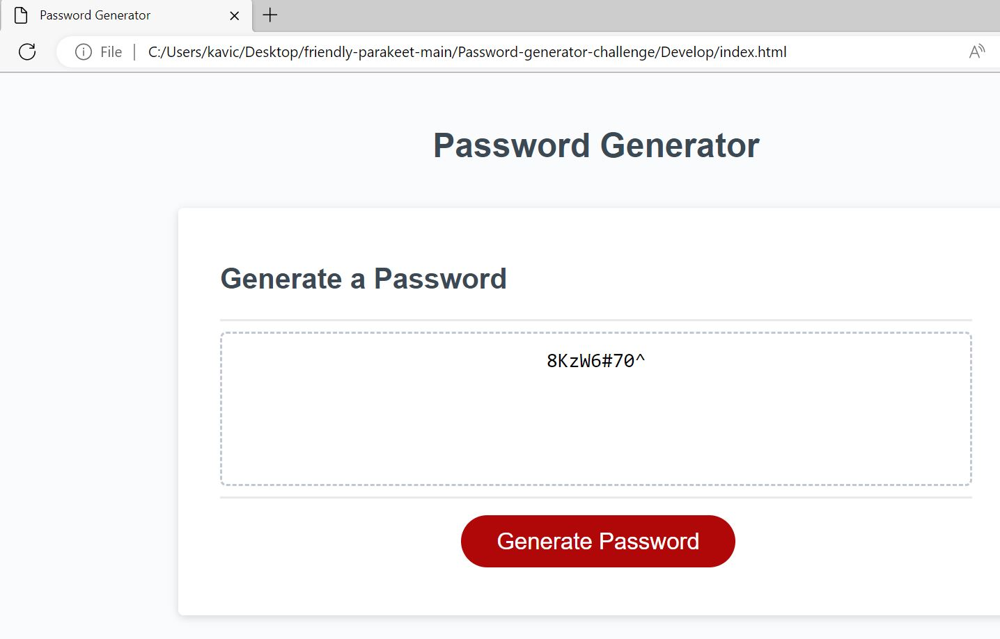

JAVASCRIPT -> Password-generator-challenge

Challenge - 3 is about javascript password generator. 

The starter code is given and then modify it to create password generator application. This app will run in the browser and will feature dynamically updated HTML and CSS powered by JavaScript code that you write. It will have a clean and polished, responsive user interface that adapts to multiple screen sizes.

## User Story

```
AS AN employee with access to sensitive data
I WANT to randomly generate a password that meets certain criteria
SO THAT I can create a strong password that provides greater security
```

## Acceptance Criteria

```
GIVEN I need a new, secure password
WHEN I click the button to generate a password
THEN I am presented with a series of prompts for password criteria
WHEN prompted for password criteria
THEN I select which criteria to include in the password
WHEN prompted for the length of the password
THEN I choose a length of at least 8 characters and no more than 128 characters
WHEN asked for character types to include in the password
THEN I confirm whether or not to include lowercase, uppercase, numeric, and/or special characters
WHEN I answer each prompt
THEN my input should be validated and at least one character type should be selected
WHEN all prompts are answered
THEN a password is generated that matches the selected criteria
WHEN the password is generated
THEN the password is either displayed in an alert or written to the page
```

## Mock-Up

The following image shows the web application's appearance and functionality:


To complete the challenge I have used the given starter code. when I click the button generate password the prompt window will pop up to get the length of the password. 


if the user pick any other characters than number then the alert message will pop up saying it not a number and please enter a valid number betweeen 8 to 128 characters. 

Once the user selected the length of the password then another prompt window pop up to ask whether to include any numbers, symbols/special character, uppercase, lowercase characters. 

Once we picked out options then the password will generated that matches the selected criteria. 

And the password will be displayed written to the page. 

Here is the screenshot of the password generated page which the user entered the password length is 9 and included numbers, special characters, uppercase, lowercase letters. 



